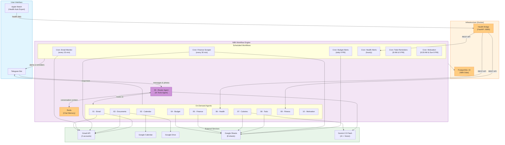
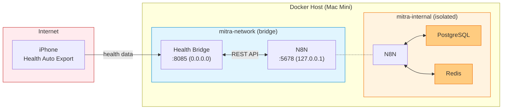

# Mitra AI Chatbot

A comprehensive AI-powered personal assistant running on N8N workflows with a Telegram bot interface. Deployed locally on Mac Mini using Docker.

## Features

| # | Feature | Description |
|---|---------|-------------|
| 1 | **Email Management** | Monitor 2 Gmail accounts, detect phishing/malicious emails, priority alerts |
| 2 | **Google Calendar** | Natural language event creation, daily agenda, conflict detection |
| 3 | **Document Organization** | Search Gmail/Drive, auto-organize to Drive (kyc/, insurance/, financial/) |
| 4 | **Budget Tracking** | 8-category budget monitoring with overspend alerts |
| 5 | **Finance Scraping** | Auto-extract transactions from emails, CC statements, dedup to Sheets |
| 6 | **Health Monitoring** | Apple Watch data - heart rate, water reminders, sleep tracking |
| 7 | **Calorie Counter** | Food photo analysis via Gemini Vision, macro tracking, sugar alerts |
| 8 | **Todo Management** | Task CRUD via Telegram, morning/evening reminders |
| 9 | **Fitness Tracking** | Running metrics, recovery assessment, nutrition recommendations |
| 10 | **Daily Motivation** | Personalized morning messages, weekly reviews, progress tracking |

## Architecture



**Stack:** N8N + PostgreSQL + Redis + FastAPI | Gemini 2.5 Flash | Google Sheets

## Quick Start

### Prerequisites
- Docker Desktop installed and running
- Python 3.12+ (for setup scripts)

### 1. Clone & Setup

```bash
cd /Users/vishalm/projects/mitra
bash scripts/setup.sh
```

This will:
- Generate encryption keys and passwords
- Guide you through Telegram bot creation
- Guide you through Google Cloud API setup
- Build Docker images

### 2. Configure APIs

Edit `.env` with your API keys:
- `TELEGRAM_BOT_TOKEN` - from @BotFather
- `TELEGRAM_CHAT_ID` - from @userinfobot
- `GEMINI_API_KEY` - from aistudio.google.com
- Google OAuth credentials in `credentials/` folder

### 3. Google OAuth (Gmail access)

```bash
python3 scripts/setup-google-oauth.py
```

### 4. Create Google Sheets

```bash
python3 scripts/setup-sheets.py
```

### 5. Start Services

```bash
make up
```

Services:
- **N8N UI:** http://localhost:5678
- **Health Bridge:** http://localhost:8085

### 6. Import Workflows

```bash
make import
```

Or manually: Open N8N UI → Import from File → select each JSON from `workflows/`

### 7. Configure N8N Credentials

In N8N UI (http://localhost:5678):
1. Go to **Settings → Credentials**
2. Add credentials for: Telegram Bot, Gmail (x2), Google Sheets, Google Drive, Google Calendar, Gemini API

### 8. Activate Workflows

In N8N UI, activate these workflows:
- `00 - Mitra Router Agent` (main bot)
- `Cron - Email Monitor`
- `Cron - Budget Alerts`
- `Cron - Health Alerts`
- `Cron - Todo Reminders`
- `Cron - Daily Motivation`
- `Cron - Finance Email Scraper`

### 9. Test

Send `/start` to your Telegram bot!

## Budget Categories

| Category | Monthly (INR) |
|----------|--------------|
| Loan | 40,000 |
| Savings | 10,000 |
| Insurances | 10,000 |
| MF SIP | 5,000 |
| Stocks | 5,000 |
| Home | 5,000 |
| Bills | 10,000 |
| Other | 5,000 |
| **Total** | **90,000** |

## Apple Watch Health Data

Install **Health Auto Export** app on iPhone:
1. Download from App Store (~$5)
2. Configure REST API export
3. Set endpoint: `http://<mac-mini-ip>:8085/health/data`
4. Enable auto-export every 30 minutes
5. Select metrics: Heart Rate, Steps, Water, Sleep, HRV, SpO2, Workouts

## Project Structure

```
mitra/
├── docker-compose.yml          # Docker services
├── .env                        # Configuration (gitignored)
├── Makefile                    # Dev commands
├── workflows/                  # N8N workflow JSONs (17 files)
│   ├── 00-router-agent.json    # Main Telegram router
│   ├── 01-10-*.json            # 10 specialized agents
│   └── cron-*.json             # 6 scheduled workflows
├── health-bridge/              # Apple Health data service
│   ├── app.py                  # FastAPI application
│   └── Dockerfile
├── config/                     # Configuration files
│   ├── budget-config.json
│   ├── email-rules.json
│   ├── document-rules.json
│   └── health-goals.json
├── scripts/                    # Setup & maintenance
│   ├── setup.sh
│   ├── setup-google-oauth.py
│   ├── setup-sheets.py
│   ├── import-workflows.sh
│   └── backup-workflows.sh
└── credentials/                # API keys (gitignored)
```

## Makefile Commands

```bash
make setup        # First-time setup
make up           # Start all services
make down         # Stop services
make restart      # Restart services
make logs         # View N8N logs
make status       # Service health check
make import       # Import workflows to N8N
make backup       # Backup workflows from N8N
make setup-google # Google OAuth setup
make setup-sheets # Initialize Google Sheets
make update       # Pull latest N8N image
make clean        # Remove all data (destructive)
```

## Workflows Overview

### On-Demand Agents (triggered via Telegram)
| Workflow | File | Description |
|----------|------|-------------|
| Router | `00-router-agent.json` | Routes messages to specialized agents |
| Email | `01-email-agent.json` | Gmail search & classification |
| Calendar | `02-calendar-agent.json` | Event management |
| Documents | `03-document-agent.json` | Document search & organization |
| Budget | `04-budget-agent.json` | Budget analysis |
| Finance | `05-finance-agent.json` | Financial analysis |
| Health | `06-health-agent.json` | Health data queries |
| Calories | `07-calorie-agent.json` | Food photo analysis |
| Todo | `08-todo-agent.json` | Task management |
| Fitness | `09-fitness-agent.json` | Workout analysis |
| Motivation | `10-motivation-agent.json` | Progress & motivation |

### Scheduled (Cron) Workflows
| Workflow | Schedule | Description |
|----------|----------|-------------|
| Email Monitor | Every 15 min | Check for malicious emails |
| Finance Scraper | Every 30 min | Extract transactions from emails |
| Budget Alerts | Daily 9 PM | Budget status report |
| Todo Reminders | 8 AM & 9 PM | Morning tasks + evening recap |
| Health Alerts | Hourly + 15 min | Water reminders + HR monitoring |
| Motivation | 6:30 AM + Sun 8 PM | Daily motivation + weekly review |

## Telegram Commands

```
/start      - Welcome message & feature list
/email      - Check recent emails
/calendar   - Today's schedule
/docs       - Search documents
/budget     - Budget status
/finance    - Financial analysis
/health     - Health dashboard
/calories   - Nutrition summary
/todo       - Task list
/fitness    - Workout stats
/motivation - Get motivated
```

Or just type naturally: "How much did I spend on food this week?"

Send a food photo to log calories automatically.

## Production Deployment

### Security Hardening (applied)
- N8N bound to `127.0.0.1` only (not exposed externally)
- Health Bridge API key required on all data endpoints
- Non-root users in all containers
- Resource limits (CPU/memory) on all services
- Log rotation configured (50MB max, 5 files)
- PostgreSQL on internal-only network (not externally accessible)
- Redis on internal-only network with volatile-lru eviction
- Request size limiting on Health Bridge (1MB max)
- CORS restricted to localhost N8N
- Swagger/ReDoc disabled in production
- Input validation with Pydantic on all health data
- `.env` file set to chmod 600

### Backup & Recovery

```bash
# Full backup (N8N workflows + PostgreSQL)
make backup

# Database-only backup
make backup-db

# Backups saved to ./backups/ directory
# Restore: pg_restore -h localhost -U n8n -d mitra_n8n backups/mitra_YYYYMMDD.dump
```

### Monitoring

```bash
# Service health
make status

# Live logs
make logs         # N8N only
make logs-all     # All services
make health-logs  # Health Bridge only

# Validate configuration
make validate
```

### Network Architecture



PostgreSQL and Redis are on an internal-only Docker network, inaccessible from outside Docker.
